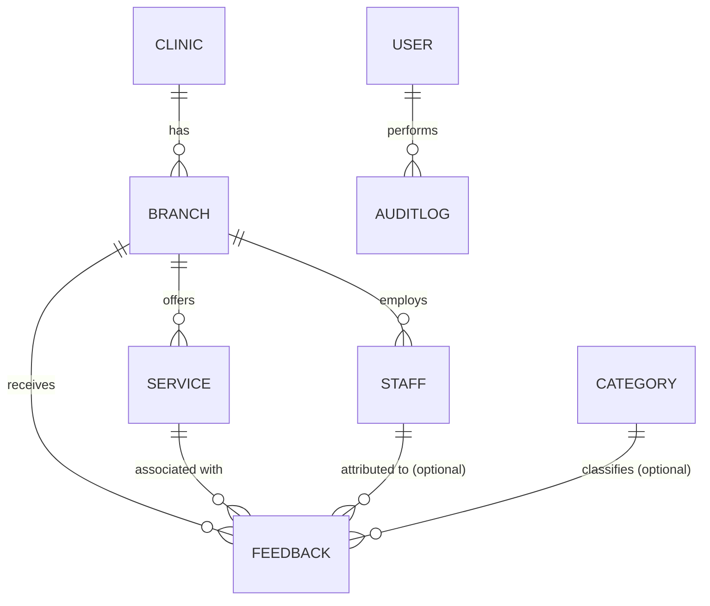

# HealSync — Database Design

**Status: Draft — Phase 2 (design; only auth tables exist in the schema)**

This document describes the **proposed domain model** for HealSync. It is a
design document — **`prisma/schema.prisma` is intentionally NOT modified in
this phase.** The schema will be implemented in the database-finalization
phase, after the open decisions below are resolved.

Related: [PRD.md](PRD.md) (product requirements) · [ARCHITECTURE.md](ARCHITECTURE.md)
(layers, analytics approach) · [API.md](API.md) (what the data must serve) ·
[SECURITY.md](SECURITY.md) (privacy, phone-number treatment).

---

## 1. Current State (Phase 1)

The schema contains only the four Better Auth core tables (required by the
authentication foundation):

| Table          | Purpose                      |
| -------------- | ---------------------------- |
| `user`         | Administrator accounts       |
| `session`      | Signed session records       |
| `account`      | Credentials / OAuth accounts |
| `verification` | Verification tokens          |

- Connection URL lives in `prisma.config.ts` (Prisma 7 pattern).
- Client is generated to `src/generated/prisma` (`prisma-client` generator).
- **Design note:** the existing `user` table is the future _administrator_
  table. Do not create a separate admin table; extend `user` (or add a role
  column) when roles are designed (PRD §16 — open decision).

---

## 2. Design Principles

1. **Normalized relational data.** One fact in one place; use foreign keys.
2. **Foreign-key integrity.** Dependents constrain deletion; no orphaned
   feedback.
3. **Appropriate indexes.** Index what query patterns actually need (§8).
4. **Timestamps.** Every entity has `createdAt`/`updatedAt` where meaningful.
5. **Unique constraints** where identity is intrinsic (e.g., branch slug
   within a clinic).
6. **Nullable vs. required.** A field is nullable only when "absent" is a
   real, meaningful state (e.g., optional comment).
7. **Soft deletion only where justified.** Archive (soft delete) is used for
   entities that must preserve historical references (clinics, branches,
   services) — see §7. Not applied everywhere automatically.
8. **Auditability.** Administrative changes to clinic data are recorded (audit
   log table, §6.6).
9. **Analytics-ready but not warehouse-ready.** The transactional schema
   supports the aggregation queries analytics needs (§9) without a separate
   analytics store.

---

## 3. Entities (Proposed)

The entities below are **proposed**. Each is justified — nothing is added
just because it was on a wishlist.

### 3.1 Clinic

The organization/brand.

| Field               | Notes                                       |
| ------------------- | ------------------------------------------- |
| id                  | PK                                          |
| name                | Required, unique                            |
| active              | Default true; archived clinics keep history |
| createdAt/updatedAt | Timestamps                                  |

**Justified?** Yes — PRD defines clinic-level management and "compare clinic
branches". Needed to group branches.

### 3.2 Branch

A physical location belonging to a clinic. **The patient selects the branch.**

| Field               | Notes                                         |
| ------------------- | --------------------------------------------- |
| id                  | PK                                            |
| clinicId            | FK → Clinic, required                         |
| name                | Required (unique within a clinic)             |
| address / city      | Optional operational context, only if needed  |
| active              | Default true; archived branches keep feedback |
| createdAt/updatedAt | Timestamps                                    |

**Justified?** Yes — feedback must be tied to a branch; branch comparison is
a core PRD requirement.

### 3.3 Service

What a patient received.

| Field               | Notes                                                           |
| ------------------- | --------------------------------------------------------------- |
| id                  | PK                                                              |
| branchId            | FK → Branch (see **Open Decision A**: branch- vs clinic-scoped) |
| name                | Required (unique within its scope)                              |
| active              | Default true                                                    |
| createdAt/updatedAt | Timestamps                                                      |

**Justified?** Yes — every feedback requires a service (FR-PAT-3); service
analysis is core.

### 3.4 Staff (conditional — see Open Decisions)

A person at a branch who can be attributed to feedback.

| Field     | Notes                                                               |
| --------- | ------------------------------------------------------------------- |
| id        | PK                                                                  |
| branchId  | FK → Branch                                                         |
| name      | Required                                                            |
| staffType | Doctor / Nurse / Receptionist / Pharmacist / Lab technician / Other |
| active    | Default true                                                        |

**Justified?** Only if staff attribution/analytics is in scope (PRD §16 open
decision). The data model supports it, but MVP may exclude it.

### 3.5 Feedback

A single patient submission — the core table.

| Field      | Notes                                                         |
| ---------- | ------------------------------------------------------------- |
| id         | PK (opaque, non-sequential to avoid enumeration)              |
| branchId   | FK → Branch, required                                         |
| serviceId  | FK → Service, required                                        |
| categoryId | FK → Category, **optional** (MVP: form keeps it optional)     |
| staffId    | FK → Staff, **optional** (only if staff in scope)             |
| phone      | Stored per policy — see §5 (PII)                              |
| phoneHash  | Optional hash for duplicate detection (see §5)                |
| rating     | Integer 1–5, required                                         |
| comment    | Text, optional, length-capped (proposed 1,000 chars)          |
| status     | Proposed: `new` / `reviewed` / `archived` — **open decision** |
| createdAt  | Server timestamp (submission time)                            |

**Indexes:** see §8.

### 3.6 FeedbackCategory

A curated list of aspects (doctor, nurse, reception, waiting time, ...).

| Field  | Notes                                    |
| ------ | ---------------------------------------- |
| id     | PK                                       |
| code   | Unique stable code (e.g. `reception`)    |
| label  | Display label                            |
| active | Default true (allows future re-labeling) |

**Justified?** PRD §9 — categories are a fixed seeded set in MVP, stored in
DB (not hardcoded in UI) so they remain comparable and future-configurable.

### 3.7 AuditLog (administrative changes)

| Field        | Notes                                  |
| ------------ | -------------------------------------- |
| id           | PK                                     |
| actorUserId  | FK → user (admin who made the change)  |
| entityType   | clinic / branch / service / staff      |
| entityId     | The changed record                     |
| action       | create / update / archive / restore    |
| before/after | JSON snapshot of the change (PII-free) |
| createdAt    | Timestamp                              |

**Justified?** PRD NFR-9 — auditability of administrative changes.

### 3.8 What is NOT modeled (justification)

| Entity               | Why not                                                                                          |
| -------------------- | ------------------------------------------------------------------------------------------------ |
| Patient              | No accounts; patients are anonymous contact points, not entities. A feedback record is the unit. |
| RatingDimension      | Post-MVP (service/staff-specific ratings) — do not model yet (PRD §8.3).                         |
| Analytics tables     | Analytics are computed, not stored (§9).                                                         |
| Notification / Alert | Post-MVP (PRD §13.2).                                                                            |

---

## 4. Relationships & Cardinality

```text
Clinic 1 ──── * Branch
Branch 1 ──── * Service
Branch 1 ──── * Staff        (if staff in scope)
Branch 1 ──── * Feedback
Service 1 ──── * Feedback
Staff  1 ──── * Feedback     (optional FK, if staff in scope)
Category 1 ── * Feedback     (optional FK)
```



Cardinality summary:

| Relationship        | Cardinality                                                |
| ------------------- | ---------------------------------------------------------- |
| Clinic → Branch     | One clinic has many branches                               |
| Branch → Service    | One branch has many services                               |
| Branch → Staff      | One branch has many staff                                  |
| Branch → Feedback   | One branch receives many feedback records                  |
| Service → Feedback  | One service is referenced by many records                  |
| Staff → Feedback    | One staff member may be attributed many records (nullable) |
| Category → Feedback | One category may classify many records (nullable)          |

---

## 5. Patient Phone Number (Sensitive PII)

The phone number is the only direct personal identifier collected in the MVP.
Its handling is governed by [SECURITY.md](SECURITY.md); this section records
the data-model implications.

### 5.1 Options under consideration

| Option                | Description                                                        | Trade-offs                                                |
| --------------------- | ------------------------------------------------------------------ | --------------------------------------------------------- |
| A. Store raw          | Normalized E.164 string. Full fidelity; enables contact/follow-up. | PII at rest; needs masking, access control, retention.    |
| B. Store hash only    | Store a keyed hash (HMAC) for dedupe/abuse; no raw number.         | Cannot contact patients; hash still needs key management. |
| C. Optional raw       | Patients may leave it blank; raw stored when given.                | Weakens follow-up and dedupe; reduces friction.           |
| D. Store raw, encrypt | Encrypt at rest with app-level key.                                | Key management complexity; stronger protection.           |

### 5.2 Working assumptions (to confirm — see Open Decisions)

- **Normalize** the number to E.164 before storage.
- **Mask by default** in admin UI (e.g. `+20x ···· 1234`) — raw visible only
  with explicit, authorized access (PRD FR-ADM-10).
- **Never log** raw phone numbers (see [SECURITY.md](SECURITY.md) §Logging).
- **Retention:** define a retention period and deletion process (open).

> Do not finalize storage strategy without resolving PRD §16 (required vs.
> optional phone) and the follow-up feature scope.

---

## 6. Conventions

### 6.1 Naming

- Tables: `snake_case`, singular model names mapped via `@@map` (existing
  convention, e.g. `@@map("user")`).
- FK columns: `<entity>Id` (e.g. `branchId`).
- Prisma models: PascalCase singular.

### 6.2 IDs

- Auth tables: string IDs (Better Auth convention).
- Domain tables: proposed opaque string IDs (e.g. `cuid2`) or UUID v4 —
  **open decision**. Prefer non-sequential to avoid enumerating feedback
  records (SECURITY consideration).

### 6.3 Timestamps

`createdAt DateTime @default(now())`, `updatedAt DateTime @updatedAt` on
mutable entities.

### 6.4 Enums vs. reference tables

- Small, stable, global values (e.g. `staffType`) → **enum**.
- Values that must remain editable/comparable across clinics (categories) →
  **reference table** (`FeedbackCategory`).
- `rating` is an integer column with a check constraint (1–5); validated in
  Zod at the boundary.

### 6.5 Nullable vs. required

- `comment`, `categoryId`, `staffId`: nullable (meaningful absence).
- `branchId`, `serviceId`, `rating`: required.
- `phone`: per resolved policy (§5, Open Decisions).

### 6.6 Audit

Administrative mutations (create/update/archive of clinics, branches,
services, staff) append to `AuditLog` (see §3.7). Feedback submissions are
immutable patient data — they are **not** audited in the audit log (they are
the domain data itself); corrections (if ever needed) are admin operations
that go through the audit trail.

---

## 7. Soft Deletion

- **Use** for Clinic, Branch, Service, Staff: a boolean `active` flag.
  Archived entities:
  - remain referenced by historical feedback (FK integrity preserved);
  - disappear from new patient selections and default admin filters;
  - can be restored.
- **Do not use** for Feedback: records are immutable; "deleting" feedback is
  an admin action with audit, and only if legally required (data deletion
  requests) — handled as a hard delete with logging, not soft-delete
  everywhere.
- No `deletedAt` columns are added unless a concrete need appears.

---

## 8. Indexing

Indexes follow **query patterns**, not field existence. Expected patterns:

| Index (proposed)                | Query pattern it serves                                                       |
| ------------------------------- | ----------------------------------------------------------------------------- |
| `Feedback(branchId)`            | Branch dashboard, branch comparison, branch-scoped filters                    |
| `Feedback(serviceId)`           | Service analysis, service-scoped filters                                      |
| `Feedback(createdAt)`           | Date-range filters and trend aggregation                                      |
| `Feedback(branchId, createdAt)` | Per-branch trends within a date range (common admin query)                    |
| `Feedback(categoryId)`          | Category filters / top-issues aggregation                                     |
| `Feedback(staffId)`             | Staff attribution queries (only if staff in scope)                            |
| `Feedback(rating)`              | Rating-distribution aggregation (may be covered by composite indexes; verify) |
| `Branch(clinicId)`              | Listing branches per clinic                                                   |
| `Service(branchId)`             | Service catalog per branch (patient flow)                                     |

Rules:

- Add indexes **during schema implementation**, after validating against real
  query shapes; avoid speculative indexes.
- Composite indexes beat single-column ones for the common
  `WHERE branchId = ? AND createdAt BETWEEN ?` pattern.
- Feedback volume is the table to watch: with millions of rows, date-range
  analytics would need a BRIN index or partitioning — revisit only at that
  scale (documented, not implemented).

---

## 9. Analytics Data

- Analytics are **computed from transactional feedback data** via SQL
  aggregation (`feedback → aggregation → results`). There is **no** separate
  analytics database, data warehouse, event stream, or OLAP store in the MVP.
- A service-layer module owns all metric definitions and parameters (date
  range, branch/service/category filters) so numbers stay consistent
  (PRD §11, [ARCHITECTURE.md](ARCHITECTURE.md) §9).
- Aggregations run on demand (dashboard queries). If dashboard performance
  ever becomes a problem, options are: precomputed summary tables or caching —
  decisions for a later phase, not MVP infrastructure.

---

## 10. Migration Policy

- Migrations are versioned in `prisma/migrations/`.
- **Development:** `pnpm prisma migrate dev` (creates and applies).
- **Production:** `pnpm prisma migrate deploy` (see
  [DEPLOYMENT.md](DEPLOYMENT.md)).
- Every product model change ships with a migration in the same PR as the
  code that uses it.
- The generated client (`src/generated/prisma`) is regenerated by
  `pnpm prisma generate` and is gitignored.

---

## 11. Open Decisions

- **A. Service scope:** do services belong to a **branch** (each branch has
  its own catalog) or to a **clinic** (shared catalog)? Affects the patient
  flow and the `Service.branchId` FK.
- **B. Phone storage:** raw / hashed / optional / encrypted (see §5) — and
  whether the phone is required at all (PRD §16).
- **C. Staff in MVP:** include `Staff` and feedback attribution now, or
  defer (PRD §16)?
- **D. Feedback status field:** `new / reviewed / archived` or purely
  transactional?
- **E. ID strategy:** opaque string IDs (cuid2/UUID) vs. auto-increment for
  domain tables.
- **F. Category reference table vs. enum** (proposed: table, per PRD §9).
- **G. Rating thresholds:** confirm satisfaction ≥4 / dissatisfaction ≤2.
- **H. Retention period** for feedback and phone numbers.
- **I. Address/city fields** on Branch — needed for MVP, or omitted?
- **J. Audit log depth:** snapshot `before/after` JSON vs. minimal action
  records.
