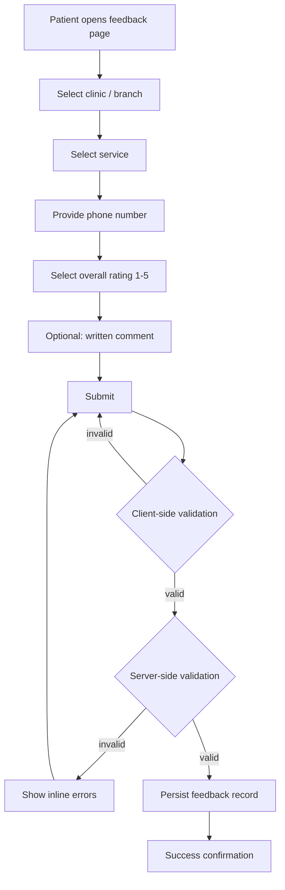
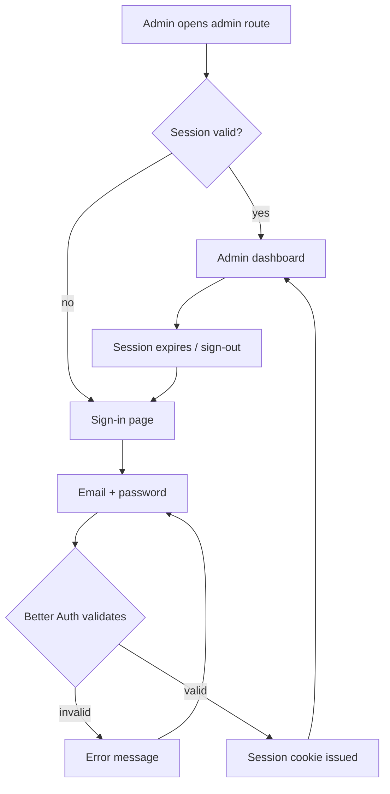
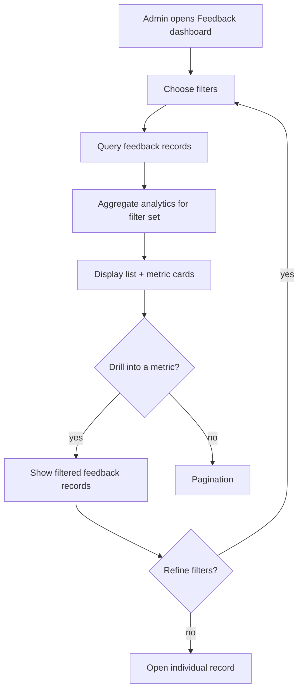
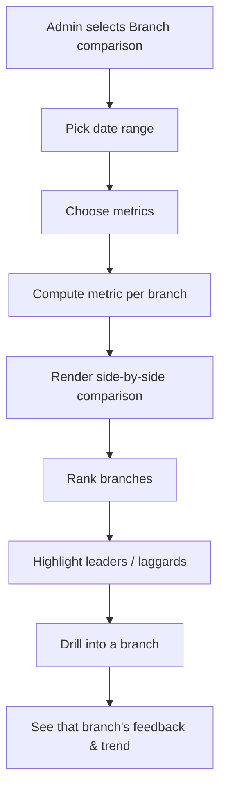
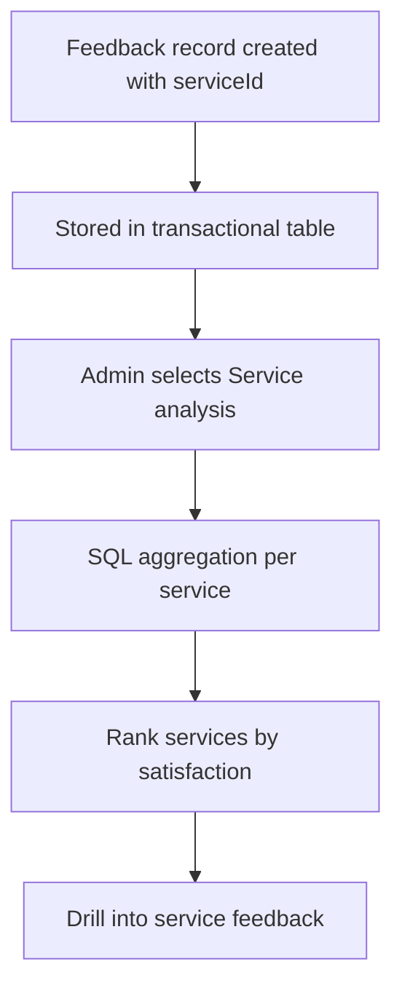
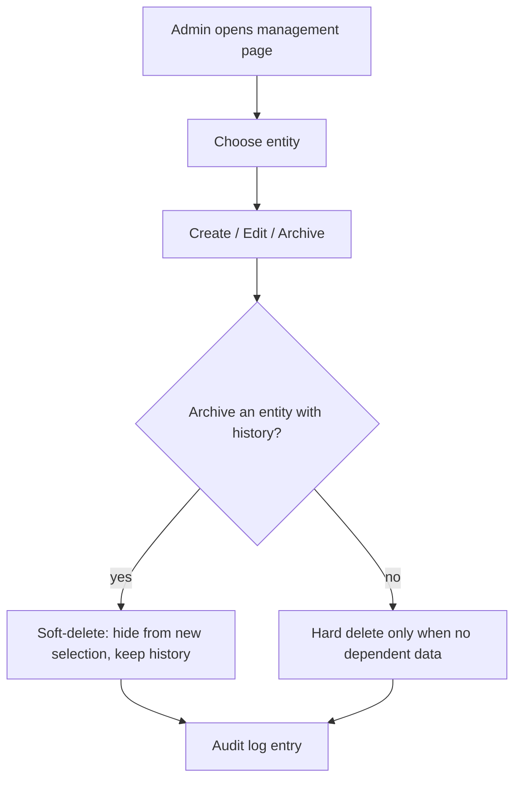

# HealSync — Workflows

**Status: Draft — Phase 2 (design)**

This document describes the end-to-end user workflows of HealSync and the
principles that govern them. It implements the behavior described in
[PRD.md](PRD.md) and defines the behavior that
[ARCHITECTURE.md](ARCHITECTURE.md), [API.md](API.md), and
[DATABASE.md](DATABASE.md) must support.

---

## 1. Workflow Map

```text
Patient workflows                     Administrator workflows
─────────────────────                 ─────────────────────────
1. Submit feedback                    3. Sign in
2. (Future) respond to follow-up      4. View & filter feedback
                                      5. Compare branches
                                      6. Analyze services
                                      7. Handle negative feedback
                                      8. Manage clinics / branches / services / staff

Development workflow
────────────────────
9. Feature branch → PR → CI → review → merge (see CONTRIBUTING.md)
```

---

## 2. Patient Feedback Workflow

### 2.1 Happy path



**Steps (referencing PRD FR-PAT-1…8):**

1. **Open feedback page** — public route (e.g. `/feedback`), no account.
2. **Select branch** — a searchable/scrollable list of branches grouped by
   clinic. The branch determines the available services.
3. **Select service** — only services offered by the chosen branch are shown.
4. **Provide phone number** — validated for format; treated as sensitive data
   (see [SECURITY.md](SECURITY.md)).
5. **Select rating** — one required choice on the 1–5 labeled scale
   (PRD §8).
6. **Optional comment** — free text, length-capped, optional.
7. **Submit** — both client- and server-side validation; the server is the
   final authority.
8. **Confirmation** — a clear success screen. No account, no further steps.

### 2.2 Validation rules (proposed)

| Field      | Required | Rules                                                                                                                                                   |
| ---------- | -------- | ------------------------------------------------------------------------------------------------------------------------------------------------------- |
| branchId   | yes      | Must reference an existing, active branch.                                                                                                              |
| serviceId  | yes      | Must belong to the selected branch's catalog (assumes branch-scoped services — see [DATABASE.md](DATABASE.md) open decision A).                         |
| phone      | proposed | E.164-style format after normalization; see PRD Open Decisions.                                                                                         |
| rating     | yes      | Integer 1–5.                                                                                                                                            |
| comment    | no       | Max length (proposed 1,000 chars); plain text, no HTML.                                                                                                 |
| categoryId | no*      | Must reference an existing category if provided; *whether the MVP form accepts it is an open decision (see [PRD.md](PRD.md) §16, [API.md](API.md) §10). |

> Exact rules are finalized in [API.md](API.md) and
> [DATABASE.md](DATABASE.md).

### 2.3 Failure paths

- **Validation errors** — inline, understandable messages next to the
  relevant field; nothing is lost from the form.
- **Server error** — a friendly generic message; the patient's input is
  preserved; a retry is offered. Internal details are never shown
  (see [SECURITY.md](SECURITY.md)).
- **Duplicate submission** — MVP: a client-side "already submitted" guard is
  not part of MVP; post-MVP duplicate detection is described in
  [API.md](API.md) §Rate limiting & abuse.

---

## 3. Administrator Sign-In Workflow



**Notes:**

- Authentication is handled by **Better Auth** (email + password),
  already mounted at `/api/auth/*` in the foundation.
- Sessions are signed cookies; admin routes and admin APIs check the session
  **server-side** on every request (see [ARCHITECTURE.md](ARCHITECTURE.md)).
- MVP assumes a single administrator role (PRD §16 — open decision).

---

## 4. Feedback Viewing Workflow



> **Note:** "export" of feedback lists is intentionally **not** part of the
> MVP (see [PRD.md](PRD.md) §13) — it is a post-MVP candidate.

**Key behaviors:**

- Filters: branch, service, category, rating, date range, free-text search
  (PRD FR-ADM-2).
- The metrics shown always reflect the **current filter set and date range** —
  no stale numbers.
- Drill-down preserves filter context (PRD FR-ADM-7).

---

## 5. Branch Comparison Workflow



**Principles:**

- **Identical metrics** are computed for every branch over the same date
  range — comparability is the point.
- Comparisons always carry a date range (PRD FR-ADM-6).
- Branch identity is masked by label; nothing sensitive is exposed in
  dashboards unnecessarily (PRD §10.6, [SECURITY.md](SECURITY.md)).

---

## 6. Service Analysis Workflow



- Feedback associated with a service flows into service-level analytics
  directly via aggregation (no separate analytics store — see
  [DATABASE.md](DATABASE.md) §Analytics data).
- Service comparisons use the same metric definitions as branch comparisons.

---

## 7. Negative Feedback Workflow

```mermaid
flowchart TD
    A[Negative feedback submitted (rating <= 2)] --> B[Stored normally]
    B --> C{Alerts configured?}
    C -- no (MVP default) --> D[Visible in admin analytics & lists]
    C -- yes (post-MVP) --> E[Notification / alert sent]
    D --> F[Admin reviews & triages]
    E --> F
    F --> G[Optional follow-up with patient via phone]
```

**Important (PRD §16):**

- Negative feedback is **not** automatically an incident.
- MVP does **not** trigger automatic alerts on negative feedback — this is a
  post-MVP capability (see [PRD.md](PRD.md) §13.2). The MVP behavior is:
  negative feedback appears in normal analytics and filters, and
  administrators review it through the standard workflows.
- No patient contact happens automatically; any follow-up is a deliberate,
  manual administrative action governed by privacy rules
  ([SECURITY.md](SECURITY.md)).

---

## 8. Administrative Management Workflows (Clinics / Branches / Services / Staff)



**Rules:**

- **Create/update** of clinics, branches, services (and staff, if in scope)
  is an authenticated admin operation (PRD FR-ADM-8).
- **Archive** (soft delete) is the default for entities that have historical
  feedback, preserving referential integrity and analytics history (see
  [DATABASE.md](DATABASE.md) §Soft deletion).
- **Destructive operations** require explicit confirmation in the UI
  (PRD FR-ADM-9).
- All administrative changes are recorded for auditability (PRD NFR-9).

---

## 9. Development & Release Workflow

```text
feature branch
      ↓
Pull Request
      ↓
review
      ↓
CI: install → prisma generate → lint → typecheck → format check → unit tests → (e2e)
      ↓
merge into main
      ↓
deployment (see DEPLOYMENT.md)
```

- Branch naming and PR expectations: see [CONTRIBUTING.md](../CONTRIBUTING.md).
- Deployment must not happen automatically from arbitrary pushes; see
  [DEPLOYMENT.md](DEPLOYMENT.md) §CI/CD.

---

## 10. Workflow Principles

1. **Patient submission is fast** — the happy path is a single short page,
   no dead ends.
2. **Validation is immediate** — client-side first, server-side as the final
   authority; errors are inline and understandable.
3. **Errors are understandable** — plain language, actionable, never internal
   stack traces.
4. **Admins drill from metrics to feedback** — every number is a door into
   the records behind it (PRD FR-ADM-7).
5. **Analytics always have clear date ranges** — no view without an explicit
   period.
6. **Filtering preserves context** — applying filters never resets the user's
   place or loses the current query.
7. **Destructive administrative operations require confirmation** — and are
   audited.
8. **Sensitive information is minimized in dashboards** — phone numbers are
   masked by default; raw data only on explicit, authorized access
   ([SECURITY.md](SECURITY.md)).
9. **No premature automation** — alerts, AI summaries, and automatic actions
   stay out of MVP unless explicitly required (PRD §13).

---

## 11. Open Decisions

- Whether patient follow-up (phone call / SMS) is an MVP feature or
  post-MVP — affects the "provide phone number" step's importance.
- Whether staff feedback attribution is in MVP (see PRD §16) — affects the
  feedback form and the staff management workflow.
- Whether archived branches/services remain selectable by patients who
  recently visited them.
- Whether negative feedback should surface a special admin triage view in
  MVP (proposed: no; covered by filters).
